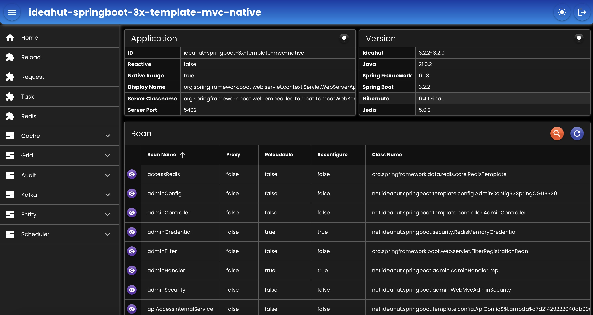

# Spring Boot 3x Template (Native WebMvc)  

- Template implementasi dari Ideahut Springboot 3x Library (Native WebMvc).
- Dokumentasi dapat dilihat di [Ideahut Springboot](https://github.com/ideahut-apps-team/ideahut-springboot-docs/)

|          |           |
|:---------|:----------|
|Web Server|Tomcat     |
|Database  |MySQL      |
|Hibernate |6.4.1.Final|
|Spring    |6.1.3      |
|Springboot|3.2.2      |
|Ideahut   |3.2.2-3.2.1|

## [Docker](https://www.docker.com/) 


### [Alpine](https://hub.docker.com/_/alpine) 
##### Build
```bash
docker build --no-cache -t ideahut-springboot-3x-template-mvc-alpine . -f Dockerfile-alpine
```
##### Run
```bash
docker run -d \
--name ideahut-springboot-3x-template-mvc-alpine \
-v <lokasi application.yml>:/apps/application.yml \
-v <lokasi extras>:/apps/extras/ \
-v <lokasi logs>:/apps/logs/ \
-p 5402:5402 \
ideahut-springboot-3x-template-mvc-alpine
```

### [Alpaquita](https://bell-sw.com/alpaquita-linux/) 
##### Build
```bash
docker build --no-cache -t ideahut-springboot-3x-template-mvc-alpaquita . -f Dockerfile-alpaquita
```
##### Run
```bash
docker run -d \
--name ideahut-springboot-3x-template-mvc-alpaquita \
-v <lokasi application.yml>:/apps/application.yml \
-v <lokasi extras>:/apps/extras/ \
-v <lokasi logs>:/apps/logs/ \
-p 5402:5402 \
ideahut-springboot-3x-template-mvc-alpaquita
```

### [Centos](https://www.centos.org/) 
##### Build
```bash
docker build --no-cache -t ideahut-springboot-3x-template-centos . -f Dockerfile-centos
```
##### Run
```bash
docker run -d \
--name ideahut-springboot-3x-template-centos \
-v <lokasi application.yml>:/apps/application.yml \
-v <lokasi extras>:/apps/extras/ \
-v <lokasi logs>:/apps/logs/ \
-p 5402:5402 \
ideahut-springboot-3x-template-centos
```

## Admin
- `URL`  : http://localhost:5402/_/web
- `User` : admin
- `Pass` : password
<div align="left">
   
</div>

##

### [Index](https://github.com/thomson470/Ideahut-Template)
